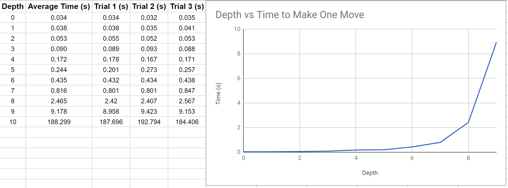

# CSE 4308 Assignment 4

### Name: Brandon Chase
## INTRODUCTION
This project implements an AI that plays Max Connect 4 using depth-limited minimax decision making with alpha-beta pruning. 

Max Connect 4 is similar to Connect 4 but the game ends when the entire board is full and the total number of 4-length streaks are scored.
## COMPILATION
From root directory, `javac -classpath . *.java`

## USAGE
### Interactive Mode: 
`java maxconnect4 interactive [input_file] [computer-next/human-next] [depth]`
* In this mode, the user can play a game against the AI at varying difficulty levels.
* *[input_file]*: file name representing the start state of the game board.
* *[computer-next/human-next]*:
    * computer-next means the computer has the first move.
    * human-next means the user has the first move.  
* *[depth]*: how many moves ahead the AI considers.

### One-Move Mode:
`java maxconnect4 one-move [input_file] [output_file] [depth]`

* In this mode, the AI makes one move based on the state of the game defined in the input file and saves the game after it made its move.
* *[input_file]*: file name representing the start state of the game board. Use input1.txt for clean game start from beginning.
* *[output_file]*: file name where the resulting game state is saved.  
* *[depth]*: how many moves ahead the AI considers.
## CODE STRUCTURE: 
* maxconnect4.java: Game controller that creates and uses GameBoard and AIPlayer classes.
* GameBoard.java: Represents the game board, its associated properties, and actions that can be performed.
* AIPlayer.java: Where the minimax logic is located. Uses Node class.

## EVALUATION FUNCTION
My evaluation function analyzes both the completed "connect 4"s and possible "connect 4"s on the board (do not need to be continuous). It looks at all possible "connect 4" streaks on the board (horizontal, vertical, and both diagonal directions). 
* Actual "Connect 4"s:
    * If all 4 slots are Player tokens, +100
* Possible "Connect 4"s in the Future:
    * If any 3 slots are Player tokens and 1 is empty, +25
    * If any 2 slots are Player tokens and 2 are empty, +10
    * If any 1 slot is a Player token and 3 are empty, +1

The same applies to enemy streaks except the specified number is subtracted from the score. 

So, equation looks something like:

**(100\*my_4_streak + 25\*my_3_streak + 10\*my_2_streak + 1\*my_1_streak) - (100\*ai_4_streak + 25\*ai_3_streak + 10\*ai_2_streak + 1\*ai_1_streak)**

## DEPTH VS TIME

